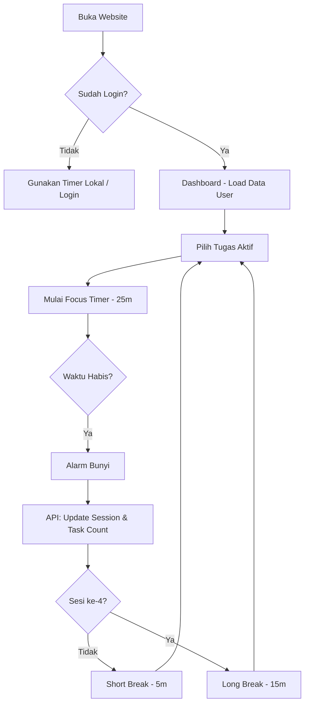

# Product Requirements Document (PRD) - Pomodoro App

**Project Name:** PomoFocus (Nama Placeholder)  
**Status:** In Development  
**Tech Stack:** Next.js, TypeScript, Bun, ElysiaJS, MySQL, Drizzle ORM.

---

## 1. Executive Summary
Aplikasi ini adalah platform manajemen waktu berbasis teknik Pomodoro yang membantu pengguna meningkatkan produktivitas dengan membagi waktu kerja menjadi interval fokus yang dipisahkan oleh istirahat pendek. Aplikasi ini juga mengintegrasikan manajemen tugas (To-Do List) dan analitik performa.

---

## 2. Target Audience
1.  **Mahasiswa/Pelajar:** Membutuhkan fokus saat belajar.
2.  **Freelancer/Remote Workers:** Membutuhkan struktur waktu kerja yang jelas.
3.  **Developer:** Pengguna yang menyukai tool minimalis dan cepat (high performance).

---

## 3. User Stories
- **Sebagai pengguna,** saya ingin memulai timer fokus (25 menit) agar saya bisa berkonsentrasi penuh pada tugas saya.
- **Sebagai pengguna,** saya ingin membuat daftar tugas agar saya tahu apa yang harus dikerjakan selanjutnya.
- **Sebagai pengguna,** saya ingin melihat statistik fokus harian saya untuk mengevaluasi produktivitas saya.
- **Sebagai pengguna,** saya ingin mengatur durasi timer kustom karena gaya fokus saya berbeda dari orang lain.
- **Sebagai pengguna,** saya ingin data saya tersinkronisasi di HP dan laptop saya.

---

## 4. Functional Requirements

### 4.1. Core Timer System
- **Tiga Mode:** Focus (25m), Short Break (5m), Long Break (15m).
- **Control:** Start, Pause, Resume, Reset.
- **Auto-Switch:** Opsi untuk otomatis memulai istirahat setelah sesi fokus selesai.
- **Browser Tab Timer:** Sisa waktu muncul di judul tab (Title).
- **Sound Notification:** Bunyi alarm saat waktu habis (pilihan suara: Bell, Bird, Digital).

### 4.2. Task Management
- **CRUD Task:** Tambah, Edit, Hapus, dan Tandai Selesai.
- **Project Folder:** Mengelompokkan tugas ke dalam kategori (Work, Study, Personal).
- **Pomo Estimation:** Menentukan target jumlah sesi Pomodoro per tugas (misal: "Coding" butuh 4 Pomo).
- **Active Task:** Memilih tugas tertentu untuk dikaitkan dengan timer yang berjalan.

### 4.3. User Authentication & Profile
- **Login/Register:** Email & Password atau Google OAuth (opsional).
- **Persistent Settings:** Menyimpan preferensi timer, suara, dan tema di database.
- **Streak System:** Menghitung hari berturut-turut pengguna mencapai target fokus harian.

### 4.4. Statistics & Analytics
- **Daily Progress:** Grafik batang total waktu fokus dalam 7 hari terakhir.
- **Task Summary:** Jumlah tugas yang diselesaikan vs yang direncanakan.
- **Heatmap:** Visualisasi aktivitas fokus selama setahun (seperti GitHub Contribution).

### 4.5. Audio & Atmosphere
- **Ambient Noise:** Suara latar belakang (Rain, White Noise, Forest, Cafe) dengan slider volume terpisah.
- **Tick-tock Sound:** Suara detak jam opsional saat timer berjalan.

---

## 5. Non-Functional Requirements

### 5.1. Performance
- **Bun Runtime:** Backend harus merespons dalam < 50ms.
- **Next.js Hydration:** Komponen timer harus langsung interaktif (Client Component) tanpa delay.
- **Type Safety:** 100% TypeScript coverage dari DB ke UI menggunakan Eden Treaty.

### 5.2. Availability & Reliability
- **PWA (Progressive Web App):** Aplikasi dapat diinstal di desktop/mobile dan berjalan luring (offline-first untuk timer).
- **Data Persistence:** Sinkronisasi data ke MySQL segera setelah sesi selesai.

### 5.3. UI/UX (User Experience)
- **Responsive Design:** Tampilan optimal di smartphone dan desktop.
- **Dynamic Theme:** Warna latar berubah otomatis (Merah untuk Focus, Hijau untuk Break).
- **Keyboard Shortcuts:** `Space` (Start/Stop), `R` (Reset), `S` (Skip).

---

## 6. Technical Architecture

### 6.1. Database Schema (Drizzle ORM)
*Refer to the previous schema discussed:*
- `users`, `projects`, `tasks`, `sessions`, `settings`, `streaks`.

### 6.2. Backend API (ElysiaJS)
- **Auth Service:** Login, Register, JWT verification.
- **Task Service:** Endpoints untuk manajemen tugas.
- **Session Service:** Logging setiap kali timer selesai.
- **Stats Service:** Agregasi data untuk grafik.

### 6.3. Frontend (Next.js)
- **State Management:** Zustand (untuk global timer state).
- **UI Components:** Shadcn UI + Tailwind CSS.
- **Data Fetching:** Eden Treaty (E2E Type Safety).

---

## 7. Roadmap & Milestones

### Phase 1: MVP (Minimum Viable Product) - Minggu 1-2
- Timer fungsional (Focus/Break).
- Local Task Management (Zustand/Local Storage).
- UI dasar (Dashboard & Settings).

### Phase 2: User System & Database - Minggu 3
- Integrasi ElysiaJS & Drizzle MySQL.
- Fitur Auth (Login/Register).
- Sinkronisasi Task ke Database.

### Phase 3: Analytics & UX - Minggu 4
- Implementasi grafik statistik harian.
- Fitur Ambient Sound.
- Optimasi PWA & Mobile View.

### Phase 4: Gamification & Polish - Minggu 5+
- Streak system & Achievements.
- Social sharing (Share progres ke Twitter/WhatsApp).
- Dark mode kustom.

---

## 8. Success Metrics
1.  **Retention:** User kembali menggunakan aplikasi 3 hari berturut-turut.
2.  **Performance:** Website mendapatkan skor Lighthouse > 90 untuk Performance dan Accessibility.
3.  **Engagement:** Rata-rata user menyelesaikan minimal 2 sesi Pomodoro per hari.

---

## 9. User Flow (Alur Pengguna)

Saya membagi alur ini menjadi 4 skenario utama: **Onboarding**, **Siklus Fokus (Core Loop)**, **Manajemen Tugas**, dan **Analitik**.

### 9.1. Onboarding & Authentication Flow
Alur saat pengguna pertama kali datang atau ingin masuk ke akun mereka.
1.  **Start:** Pengguna membuka landing page.
2.  **Pilihan:** 
    *   *Gunakan langsung:* Pengguna bisa langsung memakai timer (data disimpan di local storage sementara).
    *   *Login/Register:* Pengguna klik tombol "Sign In".
3.  **Input:** Pengguna memasukkan Email & Password.
4.  **Validation:** Backend (ElysiaJS) memvalidasi data lewat database MySQL (Drizzle).
5.  **Success:** Pengguna diarahkan ke Dashboard dengan data tugas dan pengaturan yang sudah tersinkronisasi.

### 9.2. Core Loop: Siklus Fokus (The Pomodoro Cycle)
Ini adalah alur utama aplikasi saat timer sedang digunakan.
1.  **Pilih Tugas:** Pengguna memilih tugas dari daftar (atau menambah tugas baru).
2.  **Start Timer:** Pengguna klik tombol "START" (Mode Focus - 25m).
3.  **Timer Running:** 
    *   Next.js menjalankan timer (Zustand state).
    *   Judul Tab Browser diperbarui secara real-time.
    *   *Optional:* Suara latar (Rain/Lofi) mulai diputar.
4.  **Focus Finished:** Timer mencapai 00:00.
    *   Alarm berbunyi.
    *   **Auto-Update (Backend):** Frontend mengirim sinyal ke API `/sessions` untuk mencatat sesi selesai dan menambah +1 ke `act_pomodoros` tugas terkait.
5.  **Break Choice:** Pengguna memilih/otomatis pindah ke "Short Break" (5m).
6.  **Cycle Completion:** Setelah 4 sesi fokus, sistem menyarankan "Long Break" (15m).
7.  **Loop:** Kembali ke langkah 1.

### 9.3. Manajemen Tugas (Task Management Flow)
Alur pengorganisasian pekerjaan.
1.  **Create:** Pengguna klik "Add Task".
2.  **Input:** Memasukkan judul, memilih Project (opsional), dan memasukkan estimasi jumlah Pomodoro (Pomo target).
3.  **Save:** Data dikirim ke API `/tasks` dan disimpan di MySQL.
4.  **Organize:** Pengguna bisa Drag & Drop untuk mengurutkan prioritas tugas.
5.  **Edit/Delete:** Pengguna bisa mengubah detail tugas atau menghapusnya (Soft delete).
6.  **Complete:** Pengguna mencentang tugas. Tugas berpindah ke bagian "Completed Tasks".

### 9.4. Analitik & Progress Review Flow
Alur saat pengguna ingin melihat pencapaian mereka.
1.  **Navigation:** Pengguna klik tab/ikon "Stats".
2.  **Data Fetching:** Frontend memanggil API `/stats/weekly` dan `/stats/streak`.
3.  **Visualization:** 
    *   Dashboard menampilkan grafik batang (Total menit fokus per hari).
    *   Menampilkan jumlah tugas yang selesai hari ini.
    *   Menampilkan angka "Current Streak" (api dari tabel `streaks`).
4.  **Insight:** Pengguna mengevaluasi waktu paling produktif mereka berdasarkan data history.

---

## 10. Diagram Logika Sederhana (Text-based)

